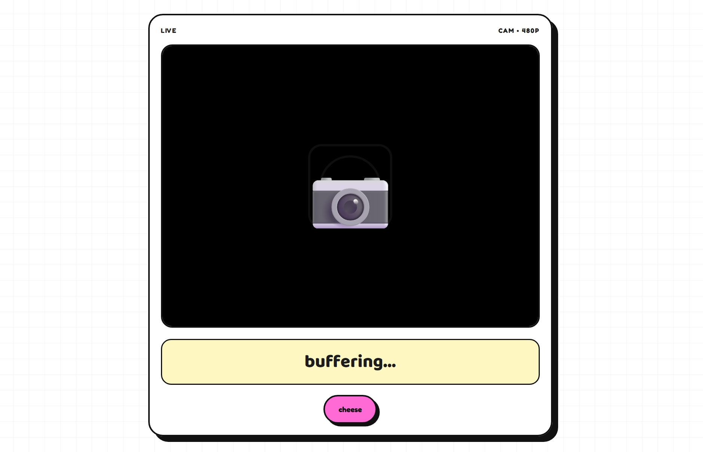
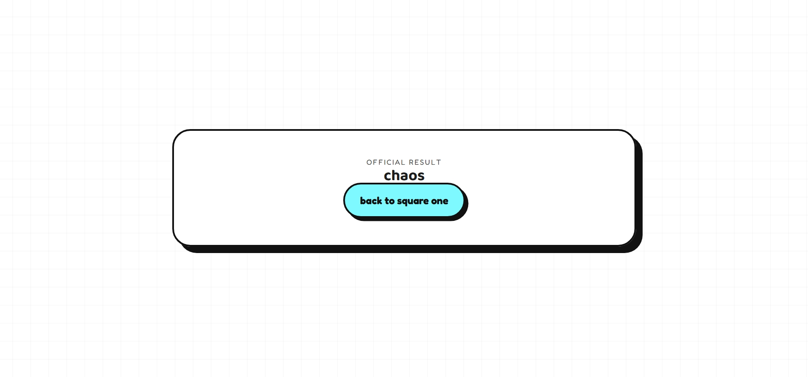

# Ith thengayalla!

### Team Name: Joel n Sneha

### Team Members
- Member 1: Joel Antony - ICCS College of Engineering and Management
- Member 2: Sneha Nilesh Parab - ICCS College of Engineering and Management

### Project Description
Ith thengayalla! is a deliberately useless web experience built around absurdity, deadpan comedy, and fake AI energy. It mimics a modern camera-based decision system but produces nonsense instead of actual insight.

### The Problem (that doesn't exist)
The world was suffering from a severe lack of pointless but highly entertaining digital chaos. People needed a tool that looked advanced, sounded smart, and solved absolutely nothing.

### The Solution (that nobody asked for)
We built a tiny static microsite where the user clicks a fake camera, waits through absurd processing screens, answers a yes/no question, and receives a completely random nonsense result. It is equal parts satire, confusion, and wholesome nonsense.

## Technical Details
### Technologies/Components Used
For Software:
- HTML
- CSS
- JavaScript
- GitHub Pages for hosting
- Browser camera API for the fake live capture flow

For Hardware:
- No dedicated hardware required
- Works on any device with a webcam and browser support

### Implementation
For Software:
# Installation
```bash
cd C:\Users\SANDHYA\Documents\absurd-project
python -m http.server 8000
```

# Run
Open the project in a browser at:

```text
http://localhost:8000/
```

### Project Documentation
For Software:

# Screenshots (Add at least 3)

*The landing screen with the absurd “ith thengayalla!” title and playful checkerboard background.*


*The fake camera interface with live preview, processing states, and absurd yes/no prompt.*


*The final nonsense result delivered in a short, gloriously useless style.*

# Diagrams

*The user flow: landing page → camera → processing → yes/no question → random result.*

### Project Demo
# Video
[Add your demo video link here]
*Explain what the video demonstrates*

# Additional Demos
[Add any extra demo materials/links]

## Team Contributions
- [Name 1]: Designed the landing page, visual identity, and overall absurd aesthetic.
- [Name 2]: Implemented the camera flow, fake processing states, and JavaScript logic.
- [Name 3]: Worked on styling, final polish, and deployment preparation.

---
Made with ❤️ at TinkerHub Useless Projects 


